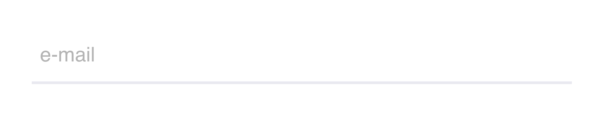
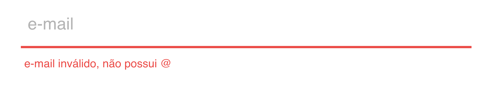
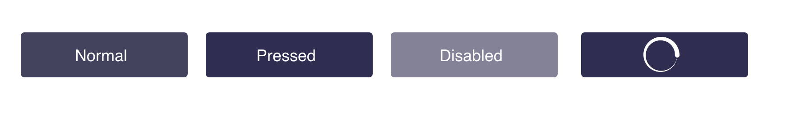

# Teste de Front-end E-thinkers 
Este teste é apresentado aos candidatos as vagas de desenvolvimento Front-end para avaliar os quesitos técnicos.

### O Desafio

Seu objetivo é criar um simples app que deve conter duas páginas, uma que exibe um formulário com os campos abaixo, e outra que liste os dados cadastrados.

* Nome
* Sobrenome
* CPF
* Telefone
* Email

### Pré-requisitos: 
 - Deve ser possível criar, listar e excluir os dados cadastrados pelo formulário;
 - Os inputs de texto e botão devem ter a aparência conforme o guia de estilo abaixo (com validações);
  - A página ser responsiva;
 - Fazer a persistência dos dados no `localStorage` ou `IndexedDB`;

Para ter o estado inicial da lista de usuário utilizar este recurso abaixo:

> GET https://private-5e3134-ethinkers.apiary-mock.com/users

Response:

```json

[
  {
    "firstname": "My name 1",
    "lastname": "My lastname 1",
    "cpf": "04080757247",
    "phone": "11987654321",
    "email": "myemail1@test.com.br"
  },
  {
    "firstname": "My name 2",
    "lastname": "My lastname 2",
    "cpf": "77797584192",
    "phone": "11987654321",
    "email": "myemail2@test.com.br"
  },
  {
    "firstname": "My name 3",
    "lastname": "My name 3",
    "cpf": "45486737688",
    "phone": "11987654321",
    "email": "myemail3@test.com.br"
  }
]
```

A partir deste ponto utilizar o `localStorage/IndexedDB` para persistir localmente as informações.

Save:

```json
{
  "firtsname": "My name 4",
  "lastname": "My lastname 4",
  "cpf": "74668869066",
  "phone": "11987654321",
  "email": "myemail4@test.com.br"
}
```

Lista local:
```json
[
  {
    "name": "My name 1",
    "lastname": "My lastname 1",
    "cpf": "04080757247",
    "phone": "11987654321",
    "email": "myemail1@test.com.br"
  },
  {
    "name": "My name 2",
    "lastname": "My lastname 2",
    "cpf": "77797584192",
    "phone": "11987654321",
    "email": "myemail2@test.com.br"
  },
  {
    "name": "My name 3",
    "lastname": "My lastname 3",
    "cpf": "45486737688",
    "phone": "11987654321",
    "email": "myemail3@test.com.br"
  },
  {
    "name": "My name 4",
    "lastname": "My lastname 4",
    "cpf": "74668869066",
    "phone": "11987654321",
    "email": "myemail4@test.com.br"
  }
]
```

### Plus:
 - Permitir edição;
 - Uso de pré-processador css;
 - Testes End to End;

### O que esperamos:
 - Testes, no mínimo testes unitários;
 - Padrão de Projeto e boas práticas de Orientação a Objetos;
 - Criar um passo a passo de como rodar sua aplicação [(Sugestão)](https://github.com/wearehive/project-guidelines/blob/master/README.sample.md);
 - Criar uma breve descrição da solução utilizada.


## Guia de estilo

### Input:
 - Cor da fonte sem foco: <span style="color:#afafaf">*#afafaf*</span>.
 - Cor da fonte com foco: <span style="color:#43425D">*#43425D*</span>.
 - Cor da borda: <span style="color:#E9E9F0">*#E9E9F0*</span>.



### Input Inválido:
 - Cor da fonte: <span style="color:#eb4a46">*#eb4a46*</span>.
 - Cor da borda: <span style="color:#eb4a46">*#eb4a46*</span>.



### Botão Habilitado:
 - Cor da fonte com foco: <span style="color:#ffffff">*#ffffff*</span>.
 - Cor de background: <span style="color:#2F2E50">*#2F2E50*</span>.

### Botão Hover:
 - Opacidade do botão com hover: 70%.

### Botão Desabilitado:
 - Cor da fonte sem foco: <span style="color:#dddcdc">*#dddcdc*</span>.
 - Cor de background: <span style="color:#838296">*#838296*</span>.

### Botão Loading:
**Criar animação de loading ao clicar no submit*



### Exemplo final


** Use sua criatividade para criar a página para listar os dados cadastrados **